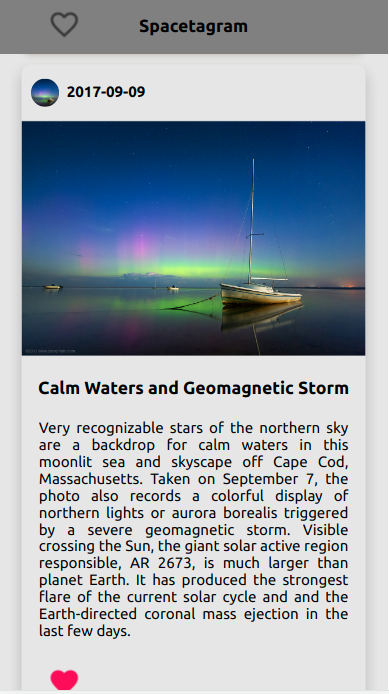

# Front End Developer Intern Challenge - Winter 2022

## Welcome! 👋

- Live Site URL: [Here](https://eloquent-lamarr-30c890.netlify.app/)

## Table of contents 🙂

- [Overview](#overview)
  - [The Challenge](#challenge)
  - [Technical requirements](#technical)
  - [Screenshot](#screenshot)
  - [Built with](#built-with)
- [Author](#author)

## Overview 🍡

Spacestagram: Image-sharing from the final frontier. Building an app to help share photos from one of NASA’s image APIs.

## The Challenge 🔥

We need a webpage that can pull images, and allow the user to “like” and “unlike” their favourite images.

We'd like a simple to use interface that makes it easy to: - Fetch data from one of NASA’s APIs and display the resulting images (more details under Technical Requirements) - Display descriptive data for each image (for example: title, date, description, etc.) - Like an image - Unlike an image

## Technical requirements 🤔

1. Search results should come from NASA’s free APIs, for which you’ll need a free API key from https://api.nasa.gov -
   - you do not need to enter anything more than your first name, last name, and email address (i.e. application url is not required)
   - We’ve provided screenshots below of demo apps we built using the Astronomy Picture of the Day or Mars Rover Photos APIs (along with Shopify’s open source React component library: Polaris).
   - You are free to use any NASA API you like
   - You are free to use any front end framework/component library you like (or none at all!)
2. Each image result should list at least a title, date of capture (ideally in earth_date) and a button to “like” that image.
3. Each image can be “liked”, and a user should be able to undo their “like”
4. The HTML that ends up being served client-side should be accessible and semantic (MDN reference)

## Screenshot 💻

  

## Built with 🧰

- React Js
- Material UI
- NASA image APIs

## Author ✨

- Linkedin - [@Saliou](https://saliou1920.github.io/Images-Gallery/)
- NASA image APIs - [@NASA](https://api.nasa.gov/)
